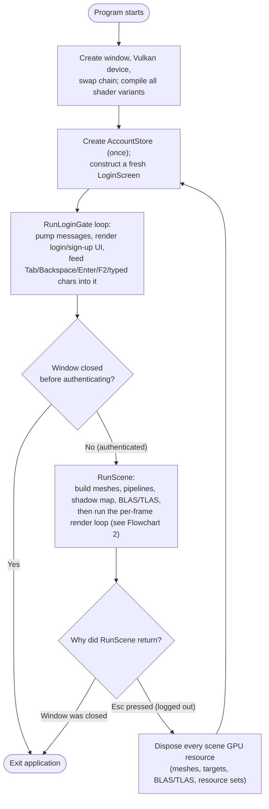
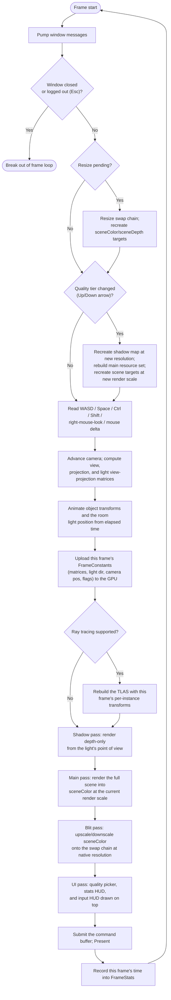

# 6 — Report

**Author:** Cal Lucas
**Project:** KingStudio Engine (KSE)
**Repository:** https://github.com/2calucas/KSE
**Document version:** 1.0
**Last updated:** 29/07/2026

---

## 6.1 Purpose of This Report

`01`–`05` record intent, research, architecture, history, and hours. This document sits on top of them: it
summarizes the project as it stands today, evaluates it honestly against the goals set out in
`01-Statement-of-Intent.md` §1.5, and takes one file — `samples/Sandbox/Program.cs` — apart in enough detail
(a control-flow diagram, a per-frame diagram, and pseudocode) that a reader who has never seen the codebase
can follow how the application actually runs, frame by frame, without reading all 816 lines first.

## 6.2 Project Summary

KSE is a personal rendering-engine project, not a finished product: a backend-agnostic GPU abstraction
(`Engine.RHI`), a complete Vulkan implementation of it (including ray-query ray tracing), a minimal
Win32 windowing layer built directly on P/Invoke, and a sample application (`run_test.exe` /
`run_me.exe`) that exercises all of it — a small real-time 3D scene (spinning cube, ground plane,
mirror/bounce spheres, and an indoor room) with shadow mapping, a free-fly camera, four selectable
quality tiers (Low/Medium/High/Ray Tracing), and, gating all of it, a local login/sign-up system with
salted, iterated password hashing.

Five projects make up the solution (`Engine.slnx`):

```
Engine.RHI            interfaces only, no graphics-API dependency
   ^        ^
   |        |
Engine.RHI.Vulkan   Engine.RHI.Direct3D12      one implementation of Engine.RHI per API
   ^
   |
Engine.Windowing    native window + input, no RHI dependency
   ^         ^
   |_________|
        |
samples/Sandbox     the test application (run_test.exe / run_me.exe)
```

The Vulkan backend and the Sandbox that runs on it are the working, demonstrable part of the project. The
Direct3D 12 backend is an honestly-documented in-progress stub (§6.5). Full file-by-file detail lives in
`03-Implementation.md`; this report does not repeat it, only summarizes and then goes one level deeper on
the single hardest file to understand.

## 6.3 Evaluation Against the Original Goals

`01-Statement-of-Intent.md` §1.5 set five goals. Evaluated against the repository as it stands today:

| # | Goal | Status | Evidence |
|---|---|---|---|
| 1 | Working cross-API rendering abstraction | **Partially met** | `Engine.RHI` interfaces are backend-agnostic and fully implemented by `Engine.RHI.Vulkan` (buffers, textures, pipelines, resource sets, command buffers, ray tracing). `Engine.RHI.Direct3D12` does not currently compile (`03-Implementation.md` §3.2) — the "cross-API" half of the goal is unfinished, not hidden. |
| 2 | Native window/input layer, no external dependency | **Met** | `Engine.Windowing`/`Win32Window.cs` is built directly on `user32.dll`/`kernel32.dll` P/Invoke; GLFW was tried in Phase 1 and dropped (`02-Research.md` §2.5). |
| 3 | Representative real-time rendering sample | **Met** | `samples/Sandbox` renders rasterized shadow-mapped geometry with four quality tiers, and, when `VK_KHR_ray_query`/`VK_KHR_acceleration_structure` are present, ray-traced shadows, reflections, and bounded multi-bounce GI (`Shaders.cs`, `VulkanAccelerationStructure.cs`). |
| 4 | Secure local account system | **Met** | `PasswordHasher.cs` (PBKDF2-HMAC-SHA256, 600,000 iterations, 128-bit random salt), `AccountStore.cs` (local JSON store, generic login-failure message to prevent username enumeration), `LoginScreen.cs` gates the scene behind authentication, and Esc now logs out cleanly (`04-Development-Log.md`, Phase 6). |
| 5 | Maintain accurate, continuous documentation | **Met** | `01`–`05` plus this report; the development log and timesheet are tied to real commit hashes/timestamps rather than a reconstructed narrative. |

Net assessment: the engine and sample are real, working, and reasonably deep (ray tracing, not just a
raster toy); the account system fully meets its own security goal; the one goal not met — a genuinely
cross-API abstraction — is explicitly and traceably documented as unfinished rather than papered over,
which was itself a stated aim (`01-Statement-of-Intent.md` §1.7).

## 6.4 Deep Dive: `Program.cs` — the Hardest Script in the Codebase

### 6.4.1 Why This Is the Hardest Script

`samples/Sandbox/Program.cs` is 816 lines — more than double the next-largest file (`Shaders.cs`, 750
lines of HLSL source strings, which is long but not control-flow-heavy). Size alone isn't what makes it
hard; three things compound:

- **It is the only file that touches almost everything else.** It's the sole place in the repository that
  constructs the graphics device, every pipeline, every mesh buffer, every overlay, the account store, and
  (when supported) every acceleration structure — so understanding it requires at least a passing
  familiarity with most of the rest of the codebase.
- **It is a hand-rolled state machine, not a linear script.** `Main()` alternates between two loops
  (`RunLoginGate` and `RunScene`) that hand control back and forth on three different exit conditions
  (window closed from the login screen, window closed from the scene, Esc pressed in the scene) — see
  §6.4.2.
- **GPU resources have no garbage collector.** Every texture, pipeline, and resource set created in
  `RunScene` must be explicitly disposed in the right order on three different triggers — window resize,
  a quality-tier change, and session end — and the same four-pass sequence (shadow → main → blit → UI) has
  to be re-recorded into one command buffer, correctly barriered, every single frame. A mistake anywhere in
  that sequence tends to surface as a black screen or a validation-layer crash rather than a clear exception
  at the point of the actual bug — see §6.4.3.

### 6.4.2 Flowchart 1 — Application-Level Control Flow

The outer state machine in `Main()`, `RunLoginGate()`, and `RunScene()`:



The important property this diagram makes explicit: closing the window and pressing Esc are **not** the
same exit path. Only the former ends the process; the latter tears the 3D scene down and drops the user
back on a fresh login screen without the process restarting — the "real logout" behaviour added in the
25/07/2026 follow-up (`04-Development-Log.md`, Phase 6).

### 6.4.3 Flowchart 2 — The Per-Frame Render Loop

The body of `RunScene`'s `while (!window.ShouldClose && !loggedOut)` loop — the part that runs roughly 60+
times a second and is responsible for most of the file's apparent complexity:



Two details worth calling out because they're easy to miss just reading the source top to bottom: the
**TLAS rebuild is a full rebuild every frame**, not an incremental refit (deliberate simplification,
`03-Implementation.md` §3.2 territory), and the **main pass renders at less than native resolution** on
Low/Medium tiers (`RenderScaleFor`) — the blit pass is what makes that invisible to the player, not a
separate upscaling technique.

### 6.4.4 Pseudocode

Language-agnostic pseudocode of the same three functions, condensed from the actual C# in
`samples/Sandbox/Program.cs`:

```text
FUNCTION Main():
    window       = CreateWindow()
    device       = CreateVulkanDevice()
    swapChain    = CreateSwapChain(window, device)
    shaders      = CompileAllShaderVariants(device)      // RT and non-RT fragment shader picked by GPU support
    accountStore = new AccountStore()                    // %LOCALAPPDATA%\KSE\accounts.json

    LOOP FOREVER:
        loginScreen = new LoginScreen(accountStore, device, shaders.ui)
        username = RunLoginGate(window, swapChain, loginScreen)

        IF username IS NULL:                             // window closed before authenticating
            RETURN

        windowClosed = RunScene(window, device, swapChain, shaders, rtSupported)

        IF windowClosed:
            RETURN
        // else: Esc was pressed inside RunScene — loop back to a fresh LoginScreen


FUNCTION RunLoginGate(window, swapChain, loginScreen) -> username OR NULL:
    SUBSCRIBE window.CharInput, window.KeyDown, window.Resized -> loginScreen

    WHILE NOT window.ShouldClose AND NOT loginScreen.IsAuthenticated:
        window.PumpMessages()
        IF resize pending: swapChain.Resize(...)
        backBuffer = swapChain.AcquireNextTexture()
        BEGIN command buffer
            CLEAR backBuffer
            loginScreen.Render(backBuffer)
        END command buffer
        SUBMIT; swapChain.Present()

    UNSUBSCRIBE window events
    RETURN window.ShouldClose ? NULL : loginScreen.LoggedInUsername


FUNCTION RunScene(window, device, swapChain, shaders, rtSupported) -> windowWasClosed:
    // ---- one-time setup for this login session ----
    CREATE samplers, frameConstantsBuffer
    activeQuality = Medium
    CREATE sceneColor/sceneDepth targets sized to (width, height) * RenderScaleFor(activeQuality)
    CREATE shadow map sized by ShadowResolutionFor(activeQuality)
    CREATE mainPipeline, shadowPipeline, blitPipeline
    UPLOAD every mesh (cube, plane, sphere, quad, cone) into GPU vertex/index buffers
    IF rtSupported:
        BUILD one BLAS per unique mesh
        BUILD one TLAS with one instance per object (12 instances: outdoor scene + 7-object indoor room)
    CREATE overlays (quality picker, stats HUD, input HUD), camera, frame-time stats

    SUBSCRIBE window.KeyDown -> (Up/Down = cycle quality, Esc = set loggedOut)
    SUBSCRIBE window.Resized -> record pendingResize

    loggedOut = FALSE
    WHILE NOT window.ShouldClose AND NOT loggedOut:
        window.PumpMessages()
        IF window.ShouldClose OR loggedOut: BREAK

        IF pendingResize:
            swapChain.Resize(...)
            RecreateSceneTargets()                        // sceneColor/sceneDepth at the new size

        IF qualityOverlay.SelectedTier != activeQuality:
            activeQuality = qualityOverlay.SelectedTier
            RECREATE shadow map at the new resolution
            REBUILD main resource set (it references the shadow map's view)
            RecreateSceneTargets()

        // ---- input ----
        READ WASD / Space / Ctrl / Shift / right-mouse-look / mouse delta (only while window has focus)
        camera.Move(...); camera.Look(...)

        // ---- per-frame scene state ----
        time = elapsed seconds since RunScene started
        animate cube/sphere/room-object model matrices and the room light position from `time`
        useRayTracedShadows = rtSupported AND activeQuality == RayTracing
        viewProjection      = camera.View * Projection
        lightViewProjection = LightView * LightOrthoProjection
        UPLOAD FrameConstants (matrices, light dir, camera pos, flags) to its GPU buffer

        backBuffer = swapChain.AcquireNextTexture()

        BEGIN command buffer
            IF rtSupported:
                REBUILD the TLAS with this frame's transforms for all 12 instances

            // shadow pass — depth only, from the light's point of view
            TRANSITION shadowMap -> DepthWrite
            BEGIN render pass (shadowMap)
                FOR EACH shadow-casting mesh: DRAW with lightViewProjection
            END render pass
            TRANSITION shadowMap -> ShaderResource

            // main pass — full scene, at render-scale resolution (not native)
            TRANSITION sceneColor -> RenderTarget
            BEGIN render pass (sceneColor + sceneDepth)
                BIND mainPipeline, mainResourceSet (frame CB, shadow map, sampler, TLAS)
                FOR EACH object (cube, plane, mirror sphere, bounce sphere,
                                 5 room surfaces, room cone, room sphere, room cube):
                    PUSH per-object constants (model matrix, albedo/reflectivity, flags)
                    DRAW indexed
            END render pass
            TRANSITION sceneColor -> ShaderResource

            // blit pass — upscale/downscale sceneColor onto the swap chain at native resolution
            TRANSITION backBuffer -> RenderTarget
            BEGIN render pass (backBuffer, cleared)
                BIND blitPipeline; DRAW full-screen quad sampling sceneColor
            END render pass

            // UI pass — overlays drawn on top, native resolution, no clear
            BEGIN render pass (backBuffer, not cleared)
                qualityOverlay.Render(); statsOverlay.Render(); inputOverlay.Render()
            END render pass

            TRANSITION backBuffer -> Present
        END command buffer

        SUBMIT command buffer; swapChain.Present()
        RECORD this frame's time into frameStats

    // ---- session end: tear down everything this function created ----
    DISPOSE sceneColor, sceneDepth, shadowMap, mainResourceSet, blitResourceSet, cached back-buffer views
    UNSUBSCRIBE window.KeyDown / window.Resized handlers registered above
    RETURN window.ShouldClose
```

## 6.5 Known Limitations

Carried forward from `03-Implementation.md` §3.2 and restated briefly here because they bound what this
report can honestly claim:

- The Direct3D 12 backend does not compile (`CS0721` in `D3D12Utils.cs`) and its ray-tracing path
  (`D3D12AccelerationStructure`) does not exist yet; the Sandbox only ever instantiates the Vulkan backend,
  so this does not affect running the application.
- There is no automated test suite; correctness has been verified by running the Sandbox and observing
  behaviour, not by unit/integration tests.
- The swap chain forces a full `WaitIdle()` on present/resize on both backends — acceptable for a
  single-window sample, not representative of production frame pacing.
- The TLAS is fully rebuilt every frame rather than incrementally refit (§6.4.3) — simpler and correct, but
  not the most performant approach for a scene this size.

## 6.6 Conclusion

The parts of KSE that were meant to be demonstrated — a real GPU abstraction driven through a working
Vulkan backend, ray tracing, and a properly-hashed local login system gating a genuine render loop — work
and are documented in enough depth (§6.4) that their behaviour doesn't have to be taken on faith. The one
goal not met, a second working graphics backend, is recorded precisely rather than hidden, in keeping with
this document set's stated approach to scope (`01-Statement-of-Intent.md` §1.7). The next practical step,
if this project continues past this document set, is fixing the Direct3D 12 build error in `D3D12Utils.cs`
and implementing `D3D12AccelerationStructure` — at that point Goal 1 in §6.3 would move from "partially
met" to "met."
