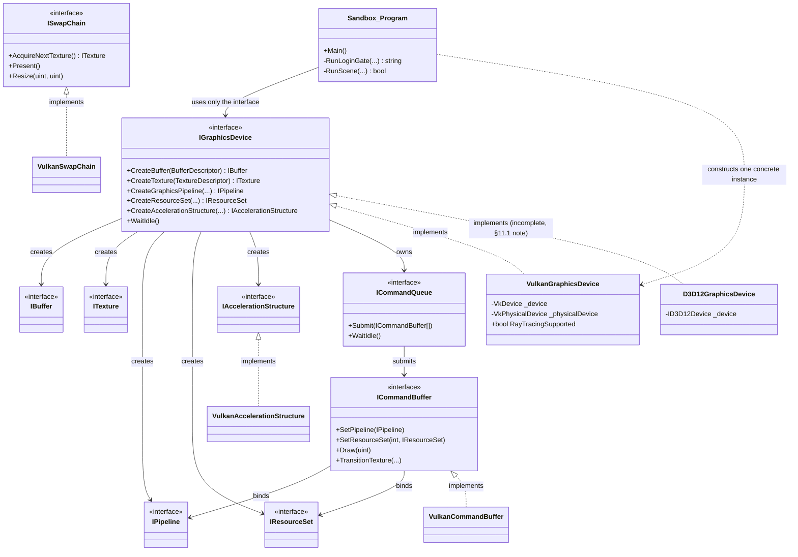

# 11 — Design

**Author:** Cal Lucas
**Project:** KingStudio Engine (KSE)
**Document version:** 1.0
**Last updated:** 29/07/2026

---

Two design documents, as required by the assessment brief, plus one dedicated specifically to data
security (§11.3): a UML class diagram of the RHI abstraction (§11.1), and an IPO chart of the account
creation/login flow (§11.2). Both map directly onto the functional requirements in `10-Requirements.md`
§10.1 (FR1–FR8 for the IPO chart; FR9–FR14 for the class diagram).

## 11.1 Design Document 1 — UML Class Diagram: the RHI Abstraction

This is the actual shape of `Engine.RHI` and how `Engine.RHI.Vulkan` implements it — the core design
decision behind the whole project (`02-Research.md` §2.1–2.2). Only the interfaces and relationships load-
bearing enough to explain the abstraction are shown; the full member list for each is in
`03-Implementation.md`.

**What this diagram is for:** it shows that `samples/Sandbox/Program.cs` only ever calls through the
`IGraphicsDevice`/`ICommandBuffer`/`ISwapChain` interfaces (top half) — the one place it touches a concrete
type is the single line that constructs `new VulkanGraphicsDevice(...)`. That one line is what a future
`new D3D12GraphicsDevice(...)` swap would need to change, which is the entire point of the RHI pattern
(`02-Research.md` §2.1). `D3D12GraphicsDevice` is shown implementing `IGraphicsDevice` because the project
compiles that far — its build error and unfinished ray-tracing path are recorded in `03-Implementation.md`
§3.2 and `06-Report.md` §6.3, not hidden from this diagram.

## 11.2 Design Document 2 — IPO Chart: Account Creation and Login

An Input-Process-Output chart for the two operations `AccountStore` exposes — chosen specifically because
this is also where this project's data-security design lives (§11.3 below expands on the Process column).

### 11.2.1 Create Account (`AccountStore.TryCreateAccount`)

| Input | Process | Output |
|---|---|---|
| Username (string, from `LoginScreen`'s username field) | 1. Trim whitespace. 2. Reject if length < 3. 3. Reject if an existing account already has this username (case-insensitive). | Success flag; error message string if rejected |
| Password (string, from the masked password field — never echoed to screen or log) | 4. Reject if length < 8. 5. Generate a random 128-bit salt (`RandomNumberGenerator.GetBytes`). 6. Derive a 256-bit hash via PBKDF2-HMAC-SHA256, 600,000 iterations (`Rfc2898DeriveBytes.Pbkdf2`). 7. The plaintext password is never itself stored, logged, or written anywhere — it exists only in memory for the duration of step 6, then goes out of scope. | New `AccountRecord` {Username, SaltBase64, HashBase64, Iterations, CreatedUtc} |
| — | 8. Append the new record to the in-memory account list. 9. Serialize the full list to JSON (source-generated, AOT-safe) and overwrite `accounts.json`. | `accounts.json` under `%LOCALAPPDATA%\KSE\` updated on disk |

### 11.2.2 Log In (`AccountStore.TryLogin`)

| Input | Process | Output |
|---|---|---|
| Username (string) | 1. Trim whitespace. 2. Look up a matching `AccountRecord` (case-insensitive). | — |
| Password (string) | 3. If a record was found, re-derive a hash from the submitted password using *that account's own stored salt and iteration count*. 4. Compare the derived hash to the stored hash using `CryptographicOperations.FixedTimeEquals` — a constant-time comparison, so response timing can't leak how many leading bytes matched. 5. If no record was found at all, still perform equivalent work and return the same generic failure, so a missing username and a wrong password are indistinguishable from the outside. | Success flag; on failure, always the single message "Invalid username or password." — never "no such user," which would let an attacker enumerate valid usernames. |
| — | 6. On success, `LoginScreen.IsAuthenticated` is set, which is the single flag `Program.cs`'s `RunLoginGate` checks to decide whether to proceed to `RunScene`. | Scene unlocked (FR7, `10-Requirements.md`) |

## 11.3 Data Security in Storage and Transmission

Required explicitly by the assessment brief; this section is the authoritative answer, cross-referenced
from `02-Research.md` §2.7, `06-Report.md` §6.7, and `10-Requirements.md` NFR1/NFR6.

- **Storage (at rest):** account records are stored as JSON at `%LOCALAPPDATA%\KSE\accounts.json` — a
  per-Windows-user folder outside the repository and outside any synced/shared location by default. Each
  record holds only a username, a random salt, a PBKDF2-HMAC-SHA256 hash, an iteration count, and a
  creation timestamp — **never** the plaintext password (§11.2.1, steps 5–7). Even someone who reads this
  file directly cannot recover a password from it in any practical amount of time; they would need to brute
  force each 600,000-iteration hash individually, and the random salt means precomputed rainbow tables are
  useless (`02-Research.md` §2.7).
- **Transmission:** KSE has no network layer at all — no client-server model, no HTTP calls, nothing sent
  off the local machine. There is therefore no transmission channel to secure, by design, rather than an
  unsecured one that was overlooked. This is recorded explicitly (not left implicit) because the assessment
  brief asks projects using "another option of your choice" to demonstrate secure transmission *and*
  storage; §6.7 of the Report justifies why "no transmission exists" satisfies that requirement for this
  specific project rather than dodging it.
- **What this design does *not* protect against:** anyone with full access to the same Windows user profile
  the account was created under (e.g. another admin account on the same machine, or physical access with
  the drive unlocked) could still overwrite or delete `accounts.json`, though not read plaintext passwords
  from it. This is a stated, deliberate boundary of the threat model (`AccountStore.cs`'s own doc comment),
  not an oversight.
